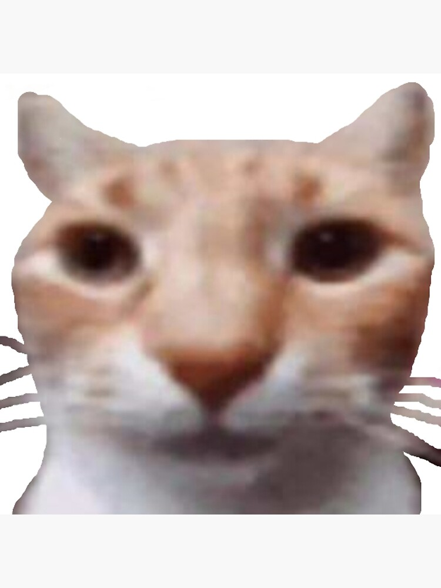
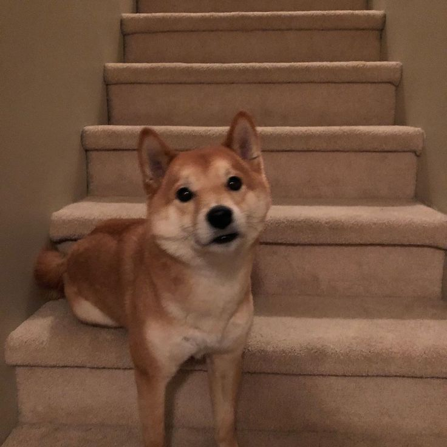
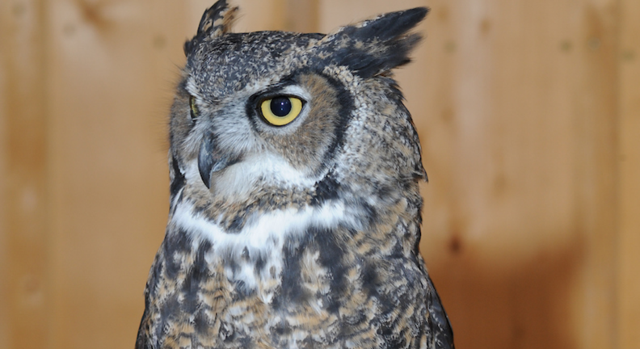

# Classify Images
### Description
This is a `FASTapi` app that takes image data encoded in `base64` in `JSON` format, and outputs
a classification label for that image based on the output of a pre-trained `DenseNet121`.

### Installation, building, and requirements
The app works on any OS, and only requires an installation of `Docker`, all other dependencies are managed by
the build.

Start by cloning this repository with its submodules.
```sh
git clone https://github.com/SelimMecanna/ClassApp.git
```
Then build the `Docker` image using [Dockerfile](https://github.com/SelimMecanna/ClassApp/blob/main/Dockerfile).
```sh
docker build -t classapp:latest .
```
Then run a container based on the image and project it on the proper port (here I use 5000 for both ports).
```sh
docker run -p 5000:5000 --name <container_name> classapp:latest
```
Now the app is running in the container.

### Functionality
The `Curl` functionality is installed automatically in the container so the command to send the 
data to the app can be done from there in the case `Curl` is not available on the local machine.
Here is the command to use it from the container.

Using the provided [data.json](https://github.com/SelimMecanna/ClassApp/blob/main/data.json) file:
```sh
docker exec -it <container_name> curl -X POST -H "Content_Type: application/json" -d @data.json http://localhost/5000/predict
```
Or provide the data in terminal command:
```sh
docker exec -it <container_name> curl -X POST -H "Content_Type: application/json" -d '{"image": "Base64_image_encoding"} http://localhost/5000/predict
```
I used the following [site](https://base64.guru/converter/encode/image) to convert images to `base64` when providing them to the app.

### Testing
For testing use the following command:
```sh
docker exec -it <container_name> pytest -v test_app.py
```
The file tests different functionalities of the app and the prediction of the model on the provided [test images](https://github.com/SelimMecanna/ClassApp/tree/main/Test_Images) as well.


Here I show some of the test images used and their proper outputs.

<div align="center">
  
  
  

*Outputs:   {"response": "Egyptian_cat"} (left), {"response": "dingo"} (middle), {"response": "great_grey_owl"} (middle) (right)*.
 </div>
